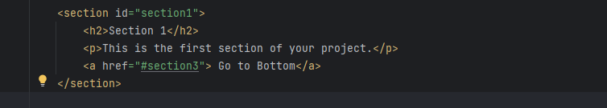

# scroll-to-elements: Explore ease of scrolling to both the top and bottom of the page!
### **How to Use?**

### 1. Connect the Script File:

#### Option 1: **Download from GitHub** [dist/app.js](https://github.com/ArtemProshkovskiy/scroll-to-elements)
```html
<script src="app.js"></script>
```

#### Option 2: **Use CDN**
```html
<script src="https://cdn.jsdelivr.net/gh/ArtemProshkovskiy/scroll-to-elements/dist/app.js"></script>
```

#### Option 3: **Use npm**
Install via npm:
```bash
npm i scroll-to-elements
```
Import and use in your JavaScript file:
```javascript
import scrollTo from "scroll-to-elements/main";
scrollTo();
```


### 2. Create a Scroll Goal ID:

Assign a unique identifier (id) to the HTML element you want to scroll to:
```html
<section id="scrollGoal">
    <!-- Your content goes here -->
</section>
```

### 3. Create a Link with href Attribute:

Generate an anchor (`<a>`) element with the href attribute pointing to the defined id:
```html
<a href="#scrollGoal">Scroll to Goal</a>
```

### 4. Create Additional Scroll Goal IDs:

You can create multiple scroll goal IDs as needed:
```html
<section id="scrollGoal1">
    <!-- Content for goal 1 -->
</section>

<section id="scrollGoal2">
    <!-- Content for goal 2 -->
</section>

<!-- Add more sections as necessary -->
```

### 5. Create Additional Links with href Attribute:

Generate anchor (`<a>`) elements with href attributes pointing to the respective IDs + you can create multiple anchors with same id:
```html
<a href="#scrollGoal1">Scroll to Goal 1</a>

<a class="sameid" href="#scrollGoal1">Scroll to Goal 1(same id)</a>

<a href="#scrollGoal2">Scroll to Goal 2</a>
<!-- Add more links as necessary -->
```

Feel free to customize IDs, link texts, and content according to your project requirements.

Check out the [demo page](https://artemproshkovskiy.github.io/scroll-to-elements/) to see how the library works.



